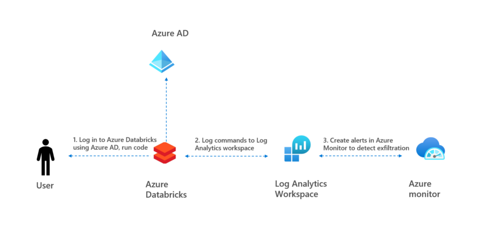

# Use Azure Monitor to detect exfiltration from Databricks

This repo shows how [Databricks security baseline](https://docs.microsoft.com/en-us/security/benchmark/azure/baselines/databricks-security-baseline) can be extented using Databricks audit logs, kusto in Log Analytics and Azure monitor. Kusto query can be found in ```detection/databricksnotebook.kusto```, deployment script can be found in  ```deployment/deployment.ps1```

Detailed explanation of solution can also be found in [my blog](https://rebremer.medium.com/how-to-prevent-data-exfiltration-from-azure-databricks-c1c55df5c9f2), see architecture below.

